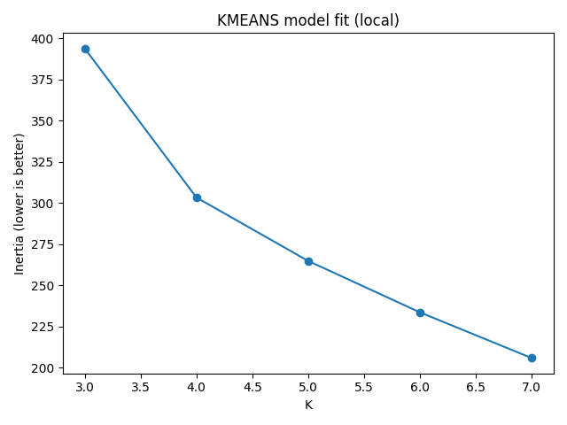
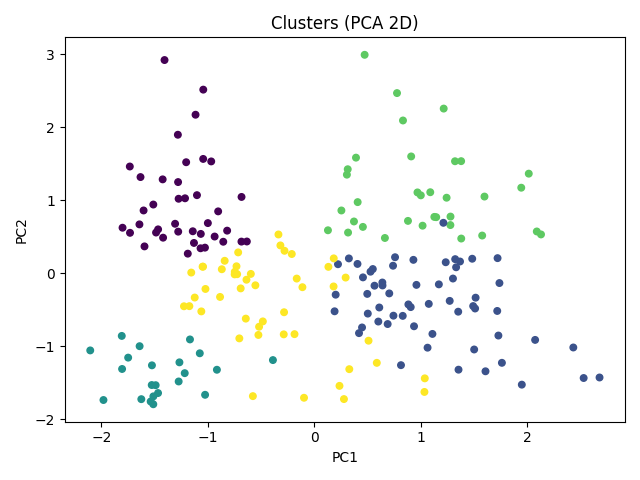

# 🛍 Mall Customer Segmentation (Clustering Project)

This project applies **unsupervised clustering** to the Mall Customer Segmentation dataset to uncover distinct shopper groups. Businesses can leverage these segments for **targeted marketing, loyalty programs, and personalized promotions**.

---

## 📊 Dataset
- Source: [Mall Customer Segmentation Dataset](https://www.kaggle.com/datasets/vjchoudhary7/customer-segmentation-tutorial-in-python)  
- 200 customers with the following features:  
  - `CustomerID`  
  - `Gender`  
  - `Age`  
  - `Annual Income (k$)`  
  - `Spending Score (1–100)`  

---

## ⚙️ Methodology
- **Preprocessing**
  - Dropped `CustomerID`
  - Encoded `Gender` into numeric
  - Standardized numeric features (`Age`, `Annual Income`, `Spending Score`)
- **Clustering**
  - Applied **KMeans** across values of K
  - Used **Elbow Method** and **Silhouette Score** to guide selection
  - Chose **K=5** for a balance of interpretability and separation
- **Outputs**
  - `cluster_assignments.csv` – each customer’s cluster ID
  - `cluster_profiles.csv` – per-cluster averages of age, income, spend
  - `elbow.png`, `silhouette.png`, `pca_scatter.png` – diagnostics & visualization
  - `clustering_report.md` – summary of results

---

## 📈 Results

### Cluster Personas
Based on the data, five distinct customer segments emerged:

- **Cluster 0: Premium Spenders**  
  - Age ~33, high income (~$86k), very high spending score (~82)  
  - ✅ *Strategy*: Loyalty programs, VIP perks, exclusive memberships

- **Cluster 1: Budget-Conscious Older Adults**  
  - Age ~55, modest income (~$48k), low spending score (~42)  
  - ✅ *Strategy*: Maintain with essential offers, avoid heavy promotional costs

- **Cluster 2: Young Value Seekers**  
  - Age ~25, low income (~$26k), high spending score (~79)  
  - ✅ *Strategy*: Student/young professional discounts, trendy promotions

- **Cluster 3: Affluent but Reserved**  
  - Age ~41, high income (~$88k), very low spending score (~17)  
  - ✅ *Strategy*: Upselling, personalized marketing, premium experiences

- **Cluster 4: Mid-tier Regulars**  
  - Age ~28, moderate income (~$50k), mid spending score (~45)  
  - ✅ *Strategy*: Encourage higher engagement with bundles & cross-selling

---

## 📊 Visuals

### Elbow Method (K vs Inertia)

### Silhouette Analysis

### PCA Scatter Plot (2D view of clusters)

---

## ✅ Interpretation
- **5 segments** provide a business-friendly breakdown of customers
- Mall management can:
  - Reward **Premium Spenders**
  - Activate **Affluent Reserved** with upselling
  - Retain **Young Value Seekers** via targeted discounts
  - Maintain steady offers for **Budget-Conscious Older Adults**
  - Grow revenue from **Mid-tier Regulars** with bundled promotions
- This demonstrates how **unsupervised clustering + domain interpretation** can directly guide marketing strategy.

---
